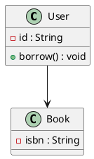
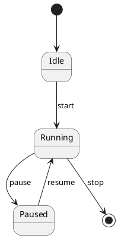

# plantuml-to-mdj

A lightweight converter from PlantUML UML diagrams to StarUML `.mdj` files.

The project aims to provide a simple way to import PlantUML diagrams into StarUML without manually redrawing them.

Currently supported:

* UML Class Diagrams
* UML State Diagrams (basic support)

Future plans:

* Activity Diagrams
* Sequence Diagrams
* Multiple diagrams in a single PlantUML file

---

## Features

### Class Diagram Support

* Classes
* Interfaces
* Enumerations
* Attributes
* Operations
* Associations
* Dependencies
* Generalizations
* Interface Realizations

### State Diagram Support

* States
* Initial State (`[*]`)
* Final State (`[*]`)
* Transitions
* Transition Events

### General Features

* Generate StarUML-compatible `.mdj`
* Automatic diagram layout
* Graphviz integration
* Duplicate ID validation
* Open directly in StarUML

---

## Requirements

* Python 3.8+
* Graphviz

Verify Graphviz installation:

```bash
dot -V
```

### Install Graphviz

Windows:

```bash
winget install graphviz
```

macOS:

```bash
brew install graphviz
```

Ubuntu / Debian:

```bash
sudo apt install graphviz
```

---

## Usage

```bash
python plantuml_to_mdj.py input.puml output.mdj
```

Open the generated file using StarUML.

---

## Example: Class Diagram



Generate:

```bash
python plantuml_to_mdj.py class_sample.puml class_sample.mdj
```

---

## Example: State Diagram



Generate:

```bash
python plantuml_to_mdj.py state_sample.puml state_sample.mdj
```

---

## Project Structure

```text
plantuml-to-mdj/
├── examples
│   ├── class_sample.puml
│   ├── class_sample.mdj
│   ├── state_sample.puml
│   └── state_sample.mdj
├── LICENSE
├── plantuml_to_mdj.py
└── README.md
```

---

## Current Limitations

### Class Diagram

* Some advanced PlantUML syntax may not be supported.

### State Diagram

* Composite states are not supported yet.
* Nested regions are not supported yet.
* Choice / Fork / Join nodes are not supported yet.
* History states are not supported yet.

---

## Roadmap

### v1.0

* Class Diagram Support

### v1.1

* State Diagram Support

---

## License

MIT License
