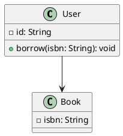
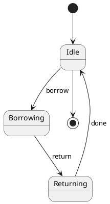
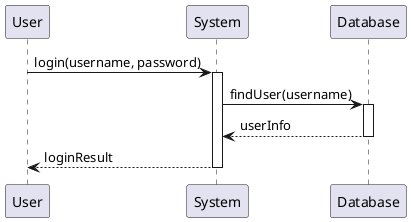

# plantuml-to-mdj

A lightweight converter from PlantUML diagrams to StarUML `.mdj` files.

This tool parses a practical subset of PlantUML syntax and generates StarUML-compatible `.mdj` project files. It currently focuses on class diagrams, state diagrams, and basic sequence diagrams.

## Features

- Convert PlantUML class diagrams to StarUML `.mdj`
- Convert basic PlantUML state diagrams to StarUML `.mdj`
- Convert basic PlantUML sequence diagrams to StarUML `.mdj`
- Support classes, interfaces and enums
- Support attributes, operations and enum literals
- Support class relationships: associations, dependencies, generalizations and realizations
- Support state transitions, initial states and final states
- Support sequence lifelines and messages
- Generate diagram views automatically
- Use Graphviz `dot` for class/state diagram automatic layout
- Validate duplicate `_id` and risky empty names before writing output

## Requirements

- Python 3.8+
- Graphviz

Make sure Graphviz is installed and `dot` is available:

```bash
dot -V
```

## Install Graphviz

Windows:

```bash
winget install graphviz
```

macOS:

```bash
brew install graphviz
```

Ubuntu / Debian:

```bash
sudo apt install graphviz
```

## Usage

```bash
python plantuml_to_mdj.py input.puml output.mdj
```

Then open the generated `.mdj` file in StarUML.

If the diagram does not open automatically, expand the model tree on the left and double-click the generated diagram.

## Class diagram example

Create a file named `class_sample.puml`:



Run:

```bash
python plantuml_to_mdj.py class_sample.puml class_sample.mdj
```

Open `class_sample.mdj` in StarUML.

## State diagram example

Create a file named `state_sample.puml`:



Run:

```bash
python plantuml_to_mdj.py state_sample.puml state_sample.mdj
```

Open `state_sample.mdj` in StarUML.

## Sequence diagram example

Create a file named `sequence_sample.puml`:



Run:

```bash
python plantuml_to_mdj.py sequence_sample.puml sequence_sample.mdj
```

Open `sequence_sample.mdj` in StarUML. In the model tree, the generated sequence diagram is usually under:

```text
Model
└── Collaboration1
    └── Interaction1
        └── SequenceDiagram1
```

## Multiple diagrams in one file

The converter can split multiple `@startuml ... @enduml` blocks.

Class and state diagrams can be combined in one PlantUML file. For example:

```plantuml
@startuml class_diagram
class User
class Book
User --> Book
@enduml

@startuml state_diagram
[*] --> Idle
Idle --> Borrowing : borrow
Borrowing --> Idle : done
Idle --> [*]
@enduml
```



The first class diagram becomes the main class diagram, and state diagrams are added to the same `.mdj` project.

For the current version, sequence diagrams should be converted in a separate `.puml` file. Mixing sequence diagrams with class/state diagrams is not recommended yet.

## Supported PlantUML subset

### Class diagrams

Supported:

- `class`, `interface`, `enum`
- attributes such as `- id: String`
- operations such as `+ borrow(isbn: String): void`
- enum literals
- common relationships such as `-->`, `..>`, `--|>`, `..|>`

### State diagrams

Supported:

- state declarations such as `state Idle`
- transitions such as `Idle --> Borrowing : borrow`
- initial state `[*] --> Idle`
- final state `Idle --> [*]`

### Sequence diagrams

Supported:

- participants such as `participant User`
- common participant keywords such as `actor`, `boundary`, `control`, `entity`, `database`, `collections`
- messages such as `User -> System: login()`
- return-style arrows such as `System --> User: result`
- basic visual activation bars

At this stage, `actor` and other participant kinds are converted to normal StarUML lifelines for compatibility.

## Legacy option

This project also keeps a legacy keyword-strict mode for a specific OO homework checker:

```bash
python plantuml_to_mdj.py input.puml output.mdj --keyword-strict
```

For general use, you do not need this option.

## Limitations

- The converter supports a practical subset of PlantUML, not the complete PlantUML language.
- Sequence diagram support is currently basic.
- Sequence diagrams should be converted as standalone files in the current version.
- Sequence `activate` / `deactivate` commands are parsed, but nested activation semantics are not fully modeled yet.
- Sequence combined fragments such as `alt`, `else`, `loop`, `opt`, `par` are not supported yet.
- Complex class diagram syntax, packages, notes, stereotypes and advanced layout instructions may not be parsed.
- Activity diagrams are not supported yet.

## License

MIT License
