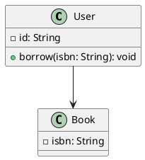

# plantuml-to-mdj

A lightweight converter from PlantUML class diagrams to StarUML `.mdj` files.

This tool parses PlantUML class/interface/enum definitions and relationships,
then generates a StarUML-compatible `.mdj` project file with automatic layout.

## Features

- Convert PlantUML class diagrams to StarUML `.mdj`
- Support classes, interfaces and enums
- Support attributes and operations
- Support enum literals
- Support associations, dependencies, generalizations and realizations
- Generate class diagram views automatically
- Use Graphviz `dot` for automatic layout
- Validate duplicate `_id` and risky empty names

## Requirements

- Python 3.8+
- Graphviz

Make sure Graphviz is installed and `dot` is available:

```bash
dot -V
```

## Install Graphviz

Windows:

```
winget install graphviz
```

macOS:

```bash
brew install graphviz
```

Ubuntu / Debian:

```bash
sudo apt install graphviz
```

## Usage

```bash
python plantuml_to_mdj.py input.puml output.mdj
```

Then open the generated `.mdj` file in StarUML.

## Example

Create a file named `sample.puml`:



Run:

```bash
python plantuml_to_mdj.py sample.puml sample.mdj
```

Open `sample.mdj` in StarUML.

## Legacy option

This project also keeps a legacy keyword-strict mode for a specific OO homework checker:

```bash
python plantuml_to_mdj.py input.puml output.mdj --keyword-strict
```

For general use, you do not need this option.

## Limitations

* Only PlantUML class diagrams are supported.
* Sequence diagrams, activity diagrams and state diagrams are not supported.
* Some complex PlantUML syntax may not be parsed yet.

## License

MIT License


